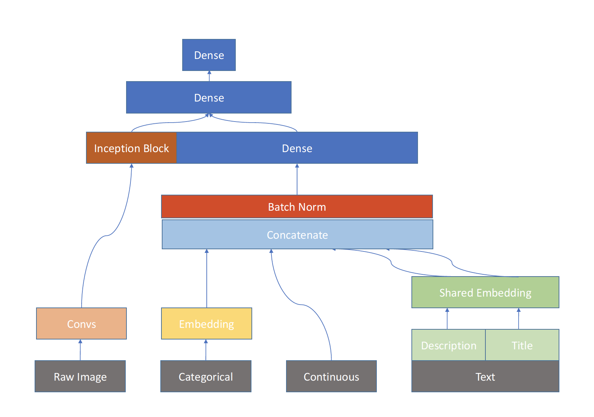

# Kaggle: Avito Demand Prediction Challenge

18th Place Solution for [Avito Demand Prediction Challenge](https://www.kaggle.com/c/avito-demand-prediction)

## Challenge Description

Avito is challenging you to predict demand for an online advertisement based on its full description (title, description, images, etc.), its context (geographically where it was posted, similar ads already posted) and historical demand for similar ads in similar contexts. With this information, Avito can inform sellers on how to best optimize their listing and provide some indication of how much interest they should realistically expect to receive.

## File Description

**emb_nn_image.py** : NN model includes text, categorical, continuous, and image features.

**ImageDataGenerator.py** : Generator for **emb_nn_image.py** which generates a batch of data.

**utility.py** : Some helper functions of conv blocks.

## Summary

**emb_nn_image.py** train data from 4 kinds of input, text, continous, categorical, raw image, simultaneously. Due to I/O limitation on GCP, it takes around 30 hours to complete a 5 fold training on K80.

The following graph briefly illustrate the structure of the model.

